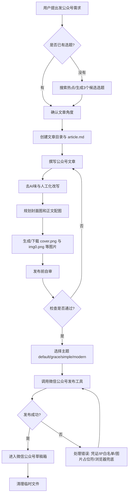
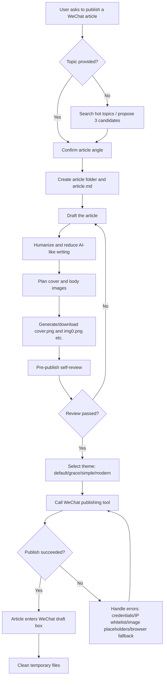

# WeChat Official Account Workflow Skill / 微信公众号全流程发布技能

[English](#english) | [中文](#中文)

---

## 中文

这是一个用于 **微信公众号文章全流程生产与发布** 的 AgentSkill。

它把一篇公众号文章从“想写什么”推进到“进入微信公众号草稿箱”：

**选题 → 写稿 → 去 AI 味 → 生成封面/配图 → 发布前自审 → 发布到草稿箱 → 清理临时文件**

适合用于：

- 公众号日常推送
- 本地民生/热点/政策解读类文章
- 需要 AI 辅助选题、写作、配图、排版、发布的内容工作流
- 想把公众号 SOP 固化成可复用技能的 OpenClaw/Codex 用户

---

### 这个技能包含什么？

```text
wechat-official-account-workflow/
├── SKILL.md
├── README.md
├── .gitignore
└── references/
    ├── content-playbook.md
    ├── gemini-browser-notes.md
    └── publishing-notes.md
```

| 文件 | 作用 |
|---|---|
| `SKILL.md` | 主技能入口，定义触发场景、完整流程、质量标准和安全规则 |
| `references/content-playbook.md` | 内容打法手册：选题、标题、开头、结构、段落节奏、结尾 |
| `references/gemini-browser-notes.md` | Gemini 浏览器配图流程、提示词模板、常见坑 |
| `references/publishing-notes.md` | 发布前检查、主题选择、API 发布命令、常见失败处理 |
| `.gitignore` | 防止误提交密钥、本地配置、生成图片和文章素材 |

---

### 工作流程图



---

### 运行必要条件

#### 1. Agent 运行环境

你需要一个支持 AgentSkill 的智能体环境，例如：

- OpenClaw
- Codex/Codex-like AgentSkill runtime
- 其他兼容 `SKILL.md` 技能格式的 Agent 系统

#### 2. 微信公众号能力

如果你希望真正发布到微信公众号草稿箱，需要：

- 一个微信公众号账号
- 已启用微信公众号开发者能力
- `WECHAT_APP_ID`
- `WECHAT_APP_SECRET`
- 当前机器出口 IP 已加入微信公众号后台 IP 白名单，或可使用浏览器发布兜底方案

推荐用环境变量或本地私有配置保存密钥：

```powershell
$env:WECHAT_APP_ID="your-app-id"
$env:WECHAT_APP_SECRET="your-app-secret"
```

不要把密钥写进仓库。

#### 3. 推荐依赖工具/技能

这个技能本身负责 **流程编排和操作规范**，实际发布/配图可结合已有工具完成。

推荐搭配：

| 工具/技能 | 用途 | 是否必需 |
|---|---|---|
| `baoyu-post-to-wechat` | 把 Markdown/HTML 文章发布到微信公众号草稿箱 | 真正发布时推荐必备 |
| [`gemini-browser-image`](https://github.com/jiao1yin2he3/gemini-browser-image-skill) | 用 Chrome + Gemini 生成封面图/正文配图 | 需要 Gemini 配图时推荐 |
| `ai-humanizer` | 检测并降低文章 AI 味 | 推荐 |
| `bun` | 运行部分微信公众号发布脚本 | 使用 `baoyu-post-to-wechat` API 脚本时需要 |
| Chrome | 浏览器配图或浏览器发布兜底 | 使用浏览器流程时需要 |
| `mcporter` + `chrome-devtools-mcp` | 控制 Chrome/Gemini 浏览器流程 | 使用 Gemini 浏览器配图时需要 |

#### 4. 图片生成能力

至少需要一种图片生成方式：

- Gemini 网页生成图片
- OpenAI/Google/其他图片生成 API
- 本地设计图/人工配图
- 免版权图库图片

技能默认要求：

- `cover.png`：公众号封面图，建议 2.35:1
- `img0.png`、`img1.png` 等：正文配图，建议 16:9

#### 5. 发布前检查能力

发布前必须确认：

- `article.md` 存在
- `cover.png` 存在
- 正文图片占位符使用 Markdown 格式：``
- 所有图片文件都存在
- 文章和配置里没有密钥、Token、Cookie 等敏感信息

---

### 安装方式

把本仓库复制到你的技能目录，例如：

```powershell
git clone https://github.com/jiao1yin2he3/wechat-official-account-workflow-skill.git
```

然后将目录放入你的 AgentSkill 搜索路径中。

在 OpenClaw 中，可放到类似：

```text
~/.openclaw/skills/wechat-official-account-workflow/
```

具体路径取决于你的 OpenClaw/Agent 配置。

---

### 使用方式

安装后，直接对 Agent 说类似指令：

```text
发一篇公众号，主题是杭州楼市新政。
```

或：

```text
帮我找一个今天适合公众号的热点选题，然后写稿、配图、发布到草稿箱。
```

Agent 会根据 `SKILL.md` 执行完整流程。

---

### 安全说明

本仓库不包含任何真实微信公众号密钥。

请不要提交：

- `.env`
- `WECHAT_APP_SECRET`
- GitHub Token
- Cookie
- 浏览器用户数据
- 未发布文章素材
- 账号私有配置

`.gitignore` 已默认排除常见敏感文件和生成素材。

---

### 致谢

这个技能不是从零发明整个发布链路，而是把多个优秀能力组合成一个可复用的公众号运营 SOP。

特别感谢/依赖以下技能和工具的思路或能力：

- [`baoyu-post-to-wechat`](https://github.com/JimLiu/baoyu-skills)  
  用于微信公众号文章发布、Markdown 转微信图文、API/浏览器发布能力。

- `ai-humanizer`  
  用于识别和降低 AI 写作痕迹，让文章更像真人编辑写出来的内容。

- OpenClaw AgentSkill 机制  
  用于把分散的操作经验沉淀成可触发、可复用、可迁移的技能。

---

## English

This is an AgentSkill for running a complete **WeChat Official Account article production and publishing workflow**.

It moves an article from idea to WeChat draft box:

**topic selection → article drafting → humanized editing → cover/body images → pre-publish review → publish to draft box → cleanup**

It is useful for:

- routine WeChat Official Account publishing
- local news, public-service, policy, and city-life articles
- AI-assisted content workflows involving writing, images, review, and publishing
- OpenClaw/Codex users who want to turn a publishing SOP into a reusable skill

---

### What is included?

```text
wechat-official-account-workflow/
├── SKILL.md
├── README.md
├── .gitignore
└── references/
    ├── content-playbook.md
    ├── gemini-browser-notes.md
    └── publishing-notes.md
```

| File | Purpose |
|---|---|
| `SKILL.md` | Main skill entry: trigger conditions, workflow, quality bar, safety rules |
| `references/content-playbook.md` | Content playbook: topics, titles, openings, structure, rhythm, endings |
| `references/gemini-browser-notes.md` | Gemini browser image workflow, prompt templates, common pitfalls |
| `references/publishing-notes.md` | Pre-publish checklist, theme selection, API command pattern, failure handling |
| `.gitignore` | Prevents secrets, local config, generated images, and article assets from being committed |

---

### Workflow diagram



---

### Requirements

#### 1. Agent runtime

You need an AgentSkill-compatible environment, for example:

- OpenClaw
- Codex or a Codex-like AgentSkill runtime
- another agent system that supports the `SKILL.md` skill format

#### 2. WeChat Official Account capability

To actually publish to the WeChat Official Account draft box, you need:

- a WeChat Official Account
- WeChat developer/API capability enabled
- `WECHAT_APP_ID`
- `WECHAT_APP_SECRET`
- the current outbound IP added to the WeChat API whitelist, or a browser-based publishing fallback

Use environment variables or ignored local config for credentials:

```powershell
$env:WECHAT_APP_ID="your-app-id"
$env:WECHAT_APP_SECRET="your-app-secret"
```

Never commit credentials to the repository.

#### 3. Recommended companion skills/tools

This skill orchestrates the workflow. Publishing and image generation can be handled by companion tools.

| Tool/Skill | Purpose | Required? |
|---|---|---|
| `baoyu-post-to-wechat` | Publish Markdown/HTML articles to the WeChat draft box | Recommended for real publishing |
| [`gemini-browser-image`](https://github.com/jiao1yin2he3/gemini-browser-image-skill) | Generate cover/body images with Chrome + Gemini | Recommended if using Gemini images |
| `ai-humanizer` | Detect and reduce AI-like writing patterns | Recommended |
| `bun` | Run some WeChat publishing scripts | Needed for certain script workflows |
| Chrome | Browser image generation or browser publishing fallback | Needed for browser workflows |
| `mcporter` + `chrome-devtools-mcp` | Control Chrome/Gemini browser workflow | Needed for Gemini browser automation |

#### 4. Image generation capability

You need at least one way to obtain images:

- Gemini web image generation
- OpenAI/Google/other image generation APIs
- manually designed images
- copyright-safe stock images

Default expected assets:

- `cover.png`: WeChat cover image, recommended 2.35:1
- `img0.png`, `img1.png`, etc.: body images, recommended 16:9

#### 5. Pre-publish verification

Before publishing, verify:

- `article.md` exists
- `cover.png` exists
- body image placeholders use Markdown syntax: ``
- all referenced images exist
- no credentials, tokens, cookies, or secrets appear in the article or config

---

### Installation

Clone this repository:

```powershell
git clone https://github.com/jiao1yin2he3/wechat-official-account-workflow-skill.git
```

Then place the folder in your AgentSkill search path.

For OpenClaw, this may look like:

```text
~/.openclaw/skills/wechat-official-account-workflow/
```

The exact path depends on your OpenClaw/agent configuration.

---

### Usage

After installation, ask your agent something like:

```text
Write and publish a WeChat Official Account article about Hangzhou housing policy.
```

or:

```text
Find a trending topic suitable for a WeChat article today, then draft it, create images, and publish it to the draft box.
```

The agent should trigger this skill and follow the workflow in `SKILL.md`.

---

### Security

This repository does not include real WeChat credentials.

Do not commit:

- `.env`
- `WECHAT_APP_SECRET`
- GitHub tokens
- cookies
- browser user data
- unpublished article assets
- account-private config

The included `.gitignore` excludes common secret files and generated assets.

---

### Acknowledgements

This skill packages an operational publishing workflow by combining several excellent capabilities.

Special thanks to / inspired by:

- [`baoyu-post-to-wechat`](https://github.com/JimLiu/baoyu-skills)  
  For WeChat Official Account article publishing, Markdown-to-WeChat conversion, and API/browser publishing workflows.

- `ai-humanizer`  
  For detecting and reducing AI-like writing patterns.

- OpenClaw AgentSkill mechanism  
  For making operational knowledge reusable as triggerable, portable skills.

